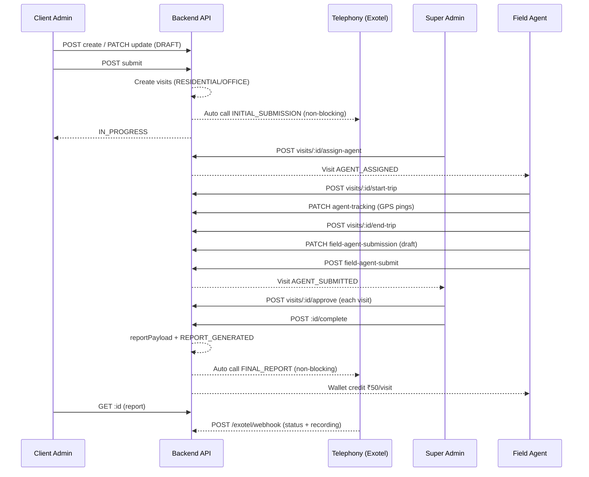

# Physical Verification — Full Flow

End-to-end documentation for the Swarajya Finance **physical verification** feature. This covers the parent/child visit model, role-based workflows, and how backend APIs map to frontend screens.

| Document | Scope |
|----------|--------|
| [PHYSICAL_VERIFICATION_BACKEND.md](./PHYSICAL_VERIFICATION_BACKEND.md) | Entities, APIs, services, status machine, report & wallet |
| [PHYSICAL_VERIFICATION_FRONTEND.md](./PHYSICAL_VERIFICATION_FRONTEND.md) | Routes, components, UI modes, service calls |

**Codebases:**
- Backend: `swarajya_finance_backend/src/modules/physical-verification/`
- Frontend: `swarajya_finance_frontend/src/app/` (client-admin, super-admin, field-agent, shared)

---

## 1. What Is Physical Verification?

A client admin creates a **physical verification case** for a loan applicant. The case may require verification at one or two addresses:

- **Residential** (home)
- **Office** (workplace)

When the client **submits** the case, the backend creates one **visit** per enabled address. Super admin assigns a **field agent** to each visit. The agent travels to the location, fills a verification form, and submits. Super admin **approves or rejects** each visit. When **all visits are approved**, super admin **completes** the case — a report is generated and field agents are credited in their wallet.

---

## 2. Data Model (Parent + Visits)

```
physical_verifications (parent)
├── applicant / coApplicant (JSON)
├── priority: HIGH | MEDIUM | LOW
├── status (rolled up from visits)
├── reportPayload (after complete)
└── visits[]
    ├── physical_verification_visits (RESIDENTIAL)
    │   ├── addressSnapshot
    │   ├── assignedFieldAgentUserId
    │   ├── fieldAgentSubmission (form + GPS + photos)
    │   └── status (per visit)
    └── physical_verification_visits (OFFICE)
        └── ...
```

| Layer | Table / entity | Purpose |
|-------|----------------|---------|
| Parent | `physical_verifications` | Client intake, priority, final report, rolled-up status |
| Child | `physical_verification_visits` | One row per address; agent assignment & submission |
| Audit | `physical_logs` | Action history (optional `visitId` scope) |

> **Legacy note:** Parent-level `assignedFieldAgentUserId` and `fieldAgentSubmission` still exist for older single-address flows. The **current primary flow** is visit-based after client submit.

---

## 3. Roles & Responsibilities

| Role | What they do |
|------|----------------|
| **Client Admin / Client User** | Create case, save draft, submit for verification, view report when completed |
| **Super Admin** | Assign agents per visit, monitor live GPS, approve/reject visits, generate report (complete) |
| **Field Agent** | Accept visit, start trip, capture location, fill verification form, submit |

---

## 4. Status Lifecycle

### 4.1 Visit status (field work unit)

```
IN_PROGRESS          ← created when client submits parent
    │
    ▼ assign agent
AGENT_ASSIGNED
    │
    ▼ start trip / save draft
AGENT_DRAFT
    │
    ▼ submit form
AGENT_SUBMITTED
    │
    ├── approve ──► APPROVED
    └── reject  ──► REJECTED
```

Agent can **decline** from `AGENT_ASSIGNED` or `AGENT_DRAFT` → visit returns to `IN_PROGRESS` (unassigned).

### 4.2 Parent status (rolled up from visits)

| Visit states | Parent status |
|--------------|---------------|
| Any `REJECTED` | `REJECTED` |
| All `APPROVED` | `APPROVED` |
| All/mix submitted | `AGENT_SUBMITTED` |
| Any draft | `AGENT_DRAFT` |
| Any assigned | `AGENT_ASSIGNED` |
| Otherwise | `IN_PROGRESS` |

### 4.3 Report completion

```
All visits APPROVED
    │
    ▼ POST /:id/complete (Super Admin)
REPORT_GENERATED
    ├── reportPayload saved on parent
    └── wallet credit ₹50 per visit agent
```

**Client-visible “Completed”** = `REPORT_GENERATED`. Edit is disabled; only report view is shown.

---

## 5. End-to-End Flow (Step by Step)

### Phase A — Client intake

1. Client opens **Physical Verification List** → **New case**.
2. Fills applicant details, enables residential and/or office address, sets **priority**, document checklist, remark.
3. **Save Draft** → parent `DRAFT`.
4. **Submit for Verification** → parent `IN_PROGRESS`, visits created (1 or 2).
5. **Telephony (side effect):** backend triggers an automatic Exotel outbound call (`INITIAL_SUBMISSION`) to `physical_verifications.mobile`. Call failure does **not** roll back submit.

### Phase B — Super admin assignment

1. Super admin opens case **View** → sees per-visit cards.
2. For each visit: **Assign field agent** (`POST /visits/:visitId/assign-agent`).
3. Visit status → `AGENT_ASSIGNED`; parent rolls up accordingly.

### Phase C — Field agent execution

1. Agent opens **Assigned Physical Cases** (visit list).
2. **Start case** → GPS captured → `POST /visits/:visitId/start-trip` → live map (`?mode=trip`).
3. Agent drives; location pings every ~60s (`PATCH /visits/:visitId/agent-tracking`).
4. **End trip** → `POST /visits/:visitId/end-trip` → verification form opens.
5. **Save draft** or **Submit details** → visit `AGENT_SUBMITTED`.
6. After submit, agent uses **Submitted** button → read-only view (map, form, admin comments).

### Phase D — Super admin review

1. Super admin reviews each visit submission on case view.
2. **Approve** (`POST /visits/:visitId/approve`) or **Reject** with reason/note.
3. When **all visits** are `APPROVED` → **Complete** / Generate report.

### Phase E — Report & wallet

1. `POST /physical-verifications/:id/complete` builds `reportPayload`.
2. Parent → `REPORT_GENERATED`.
3. Each visit’s assigned agent receives **₹50** wallet credit (idempotent per visit).
4. **Telephony (side effect):** automatic Exotel outbound call (`FINAL_REPORT`) to customer mobile. Call failure does **not** roll back complete.
5. Client admin sees **Report** button only (no edit).

### Phase F — Customer call history (optional)

1. Super Admin can **Recall Customer** from case view (`POST /physical-verifications/:id/recall` or `POST /exotel/recall`).
2. Exotel posts status/recording updates to `POST /exotel/webhook`.
3. Super Admin and Client Admin can listen to recordings from **Customer Call History** UI.

---

## 6. Flow Diagram



---

## 7. Priority

Set on client form: `HIGH` | `MEDIUM` | `LOW` (default `MEDIUM`).

Shown as colored badges on client list and field agent case list.

---

## 8. GPS & Map

| Stage | Who sees map | Mode |
|-------|--------------|------|
| Active trip | Field agent | Live tracking, end trip |
| Live monitoring | Super admin | Polls visit every 60s |
| After submit | Field agent (view) | Read-only: trip start, visit address, route |

Route history stored in `fieldAgentSubmission.agentTracking.routeHistory` (max 100 points).

---

## 9. File Uploads

Agents upload photos/documents during verification:

- Visit flow: `POST /visits/:visitId/field-upload`
- Files stored under `uploads/physical-verifications/`
- Served at `GET /physical-verifications/files/view/:filename`

---

## 10. API Base Path

```
{API_PREFIX}/physical-verifications
```

Default: `/api/physical-verifications`

All routes require JWT + role guard (`SUPER_ADMIN`, `CLIENT_ADMIN`, `CLIENT_USER`, `FIELD_AGENT` as applicable).

---

## 11. Key Frontend Routes

| Role | List | Work screen | Report |
|------|------|-------------|--------|
| Client Admin | `/client-admin/physical-verification-list` | `/client-admin/physical-form/:id` | `/client-admin/physical-report/:id` |
| Super Admin | `/super-admin/physical-verification-list` | `/super-admin/physical-verification-view/:id` | `/super-admin/physical-verification-report/:id` |
| Field Agent | `/field-agent/loan-case-list` | `/field-agent/physical-case-view/:visitId` | `/field-agent/physical-report/:parentId` |

---

## 12. Verification Types

`PD`, `FI`, `RCU`, `Investigation`, `Mystery Call`, `Mystery Shopping`, `Complaint`

When type is `FI`, an additional **FI type** field is required on the client form.

---

## 13. Related Modules

| Module | Relation |
|--------|----------|
| `field-agent-wallet` | Credits on case complete |
| `telephony` | Exotel outbound calls after submit/complete; call history + recall |
| `verification` (legacy) | Separate `verification_requests` aggregate — not the same as standalone physical cases |

---

## 14. Quick Reference — Visit API Endpoints

| Action | Method | Path |
|--------|--------|------|
| List assigned visits | GET | `/visits/assigned` |
| Get visit | GET | `/visits/:visitId` |
| Assign agent | POST | `/visits/:visitId/assign-agent` |
| Start trip | POST | `/visits/:visitId/start-trip` |
| End trip | POST | `/visits/:visitId/end-trip` |
| Save draft | PATCH | `/visits/:visitId/field-agent-submission` |
| Submit | POST | `/visits/:visitId/field-agent-submit` |
| GPS ping | PATCH | `/visits/:visitId/agent-tracking` |
| Decline | POST | `/visits/:visitId/decline` |
| Approve | POST | `/visits/:visitId/approve` |
| Reject | POST | `/visits/:visitId/reject` |
| Upload file | POST | `/visits/:visitId/field-upload` |

Full parent endpoints and implementation detail → [Backend doc](./PHYSICAL_VERIFICATION_BACKEND.md).

UI components and modes → [Frontend doc](./PHYSICAL_VERIFICATION_FRONTEND.md).
