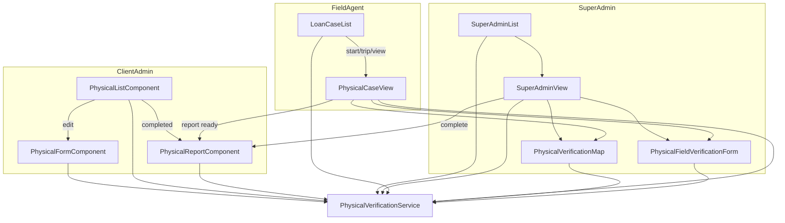

# Physical Verification — Frontend

Angular frontend for physical verification in `swarajya_finance_frontend`.

**Service:** `src/app/services/physical-verification.service.ts`  
**Models:** `src/app/client-admin/physical-verification.models.ts`, `field-agent-submission.models.ts`  
**API constant:** `PHYSICAL_VERIFICATIONS_API` → `{baseUrl}/physical-verifications`

---

## 1. Application Areas

| Area | Path prefix | Users |
|------|-------------|-------|
| Client Admin | `/client-admin/` | Client admin, client user |
| Super Admin | `/super-admin/` | Platform super admin |
| Field Agent | `/field-agent/` | Field agents |
| Shared | `src/app/shared/` | Reusable map component |
| Report | `client-admin/physical-report/` | Shared across all roles |

---

## 2. Routes

Defined in `src/app/app.routes.ts`.

### 2.1 Client Admin

| Path | Component | Guards |
|------|-----------|--------|
| `/client-admin/physical-verification-list` | `PhysicalListComponent` | `authGuard`, `clientAdminGuard`, `verificationAccessGuard('physical')` |
| `/client-admin/physical-form` | `PhysicalFormComponent` (create) | same |
| `/client-admin/physical-form/:id` | `PhysicalFormComponent` (edit) | same |
| `/client-admin/physical-report/:id` | `PhysicalReportComponent` | same |

### 2.2 Super Admin

| Path | Component | Guards |
|------|-----------|--------|
| `/super-admin/physical-verification-list` | `SuperAdminPhysicalVerificationListComponent` | `authGuard`, `superAdminGuard`, `permissionGuard('VERIFICATION')` |
| `/super-admin/physical-verification-view/:id` | `SuperAdminPhysicalVerificationViewComponent` | `authGuard`, `superAdminGuard` |
| `/super-admin/physical-verification-report/:id` | `PhysicalReportComponent` | `authGuard`, `superAdminGuard` |

### 2.3 Field Agent

| Path | Component | Guards |
|------|-----------|--------|
| `/field-agent/loan-case-list` | `LoanCaseList` | `authGuard`, `fieldAgentGuard` |
| `/field-agent/physical-case-view/:id` | `FieldAgentPhysicalCaseViewComponent` | `authGuard`, `fieldAgentGuard` |
| `/field-agent/physical-report/:id` | `PhysicalReportComponent` | `authGuard`, `fieldAgentGuard` |

> `:id` on field agent case view is **visitId**, not parent id. Report route uses **parent** id.

### 2.4 Guards

| Guard | Allows |
|-------|--------|
| `clientAdminGuard` | Client users + platform users |
| `superAdminGuard` | Platform users only |
| `fieldAgentGuard` | Field agents only |
| `verificationAccessGuard('physical')` | Client feature `physical` + `VERIFICATION` permission |

Menu visibility: `MenuService` — Physical Verification when feature enabled.

---

## 3. Client Admin UI

### 3.1 Physical List (`physical-list/`)

**File:** `physical-list.component.ts` / `.html`

**Features:**
- Stats cards (draft, in progress, completed, etc.)
- Paginated table with search and filters (status, verification type, FI type)
- Priority badges (`HIGH` / `MEDIUM` / `LOW`)

**Row actions:**

| Status | Actions |
|--------|---------|
| Not `REPORT_GENERATED` | Edit (pencil) → physical form |
| `REPORT_GENERATED` (Completed) | Report only — **no edit** |

**API calls:**
- `list(query)` — GET `/`
- `stats()` — GET `/stats`

### 3.2 Physical Form (`physical-form/`)

**Modes:** create (no `:id`) | edit (`:id`)

**Sections:**
- Verification type (+ FI type when `FI`)
- Applicant party (customer, agreement, mobile, product, addresses)
- Optional co-applicant
- Document type verification rows
- Priority selector
- Complete remark

**Address rules:** At least one of residential or office required per party.

**Actions:**

| Button | Validation | API | Result |
|--------|------------|-----|--------|
| Save Draft | `draft` mode | `create` / `update` | `DRAFT` → list |
| Submit for Verification | `submit` mode | `create`/`update` then `submit` | `IN_PROGRESS` → list |

**API calls:**
- `create(payload)` — POST `/`
- `update(id, payload)` — PATCH `/:id`
- `submit(id)` — POST `/:id/submit`
- `getById(id)` — GET `/:id` (edit load)

### 3.3 Physical Report (`physical-report/`)

**Shared component** used by client admin, super admin, and field agent.

**Behavior:**
- Loads parent record → renders `reportPayload`
- `isSuperAdminView` from URL controls back navigation
- Client admin: **no Edit button** when `status === REPORT_GENERATED`
- **Customer Call History** card (`app-customer-call-history`) — client can listen to recordings; recall button only when `isSuperAdminView`

**API:** `getById(id)` — GET `/:id`  
**Telephony:** `TelephonyService.getCalls(id)` — GET `/exotel/calls/:id`

---

## 4. Super Admin UI

### 4.1 List (`super-admin/physical-verification-list/`)

**Features:**
- Same filters as client list + **client** dropdown
- Delete case action
- Agent driving indicator on rows

**Actions:** View details, Report (if completed), Delete

**API calls:**
- `list(query)`, `stats()`, `delete(id)`
- `ClientService.list` — client filter

### 4.2 View (`super-admin/physical-verification-view/`)

**Two operational modes:**

#### A. Visit-based (primary) — `record.visits.length > 0`

Per-visit card for each address:

| UI block | Purpose |
|----------|---------|
| Address snapshot | Residential / office details |
| Agent assign dropdown | `assignVisitAgent` |
| Live map | Polls visit tracking every 60s when agent driving |
| Read-only form | Agent submission when submitted |
| Approve / Reject | Per-visit review with note/reason |

**Parent actions:**
- **Complete / Generate report** — enabled when all visits `APPROVED`
- Calls `complete(id)` → also triggers auto `FINAL_REPORT` call on backend
- **Customer Call History** — timeline of Exotel calls + HTML5 audio player
- **Recall Customer** — `POST /physical-verifications/:id/recall`

#### B. Legacy parent-level — no visits

- Single agent assignment on parent
- Approve/reject on parent submission
- Live map on parent tracking

**Activity log:** `getLogs(id)` with human-readable action labels (includes telephony actions)

**API calls:**
- `getById(id)` — load + polling
- `assignVisitAgent(visitId, agentId)`
- `approveVisit(visitId)`, `rejectVisit(visitId, reason, note)`
- `complete(id)`
- `TelephonyService.getCalls` / `recallViaPhysicalVerification`
- `assignFieldAgent`, `approve`, `reject` — legacy
- `UserService.list({ role: 'FIELD_AGENT' })` — agent picker

---

## 5. Field Agent UI

### 5.1 Loan Case List (`field-agent/loan-case-list/`)

Lists **assigned visits** via `listAssignedVisits()`.

**Columns:** customer, agreement, address type, priority, status, actions

**Row actions by status:**

| Status | Button | Action |
|--------|--------|--------|
| `AGENT_ASSIGNED` | Start (play) | Confirm → GPS → `startVisitTrip` → navigate `?mode=trip` |
| `AGENT_DRAFT` + driving | Resume trip | Navigate `?mode=trip` |
| `AGENT_DRAFT` + trip ended | Continue form | Navigate `?mode=trip` (form shown) |
| `AGENT_SUBMITTED` / `APPROVED` / `REJECTED` | **Submitted** | Navigate `?mode=view` |
| `AGENT_ASSIGNED` / `AGENT_DRAFT` | Remove (×) | `declineVisit` — confirm dialog |
| Other | View (eye) | Navigate `?mode=view` |

**API:** `listAssignedVisits`, `startVisitTrip`, `declineVisit`

Uses `ConfirmDialogService` (SweetAlert2) for confirmations.

### 5.2 Physical Case View (`field-agent/physical-case-view/`)

**Route param:** `visitId`  
**Query param:** `mode` = `view` | `trip` | (default auto-resolved)

#### Page modes

| Mode | Trigger | UI |
|------|---------|-----|
| `view` | `?mode=view` | Case overview; submitted = read-only map + form |
| `trip` | `?mode=trip` or active driving | Live map, end trip, then form |
| `default` | Auto from visit state | Resolves to trip or form |

#### Active trip flow

1. Map with `enableDriving`, `tripEndMode`, destination from visit `addressType`
2. GPS watch + server pings (`updateVisitTracking`) every ~60s
3. **End trip** → `endVisitTrip` → verification form
4. **Save draft** → `saveVisitSubmission`
5. **Submit details** → `saveVisitSubmission` + `submitVisitSubmission` → locked

#### Submitted read-only view (`isReadOnlySubmittedView`)

When `mode=view` and status is `AGENT_SUBMITTED` | `APPROVED` | `REJECTED`:

- Status banner + submitted date
- Super admin `rejectionReason` / `adminReviewNote`
- Visit details (trip start/end times)
- Read-only map (`readOnly=true`): trip start, visit address, route
- Read-only form (`disabled=true`)

**API:** `getVisitById`, `endVisitTrip`, `saveVisitSubmission`, `submitVisitSubmission`

### 5.3 Physical Field Verification Form (`field-agent/physical-field-verification-form/`)

**Reused in:** field agent case view, super admin view (read-only)

**Inputs:**
- `form` — `FieldAgentSubmission`
- `visitId` / `recordId`
- `disabled` — read-only mode
- `hasResidential`, `hasOffice`
- `fieldErrors`, `submitted`

**Sections:**
- Residential: address correctness, meet person, family, neighbours, geo, photos, remarks
- Office: company details, colleagues, salary, geo, photos, remarks

**File upload:** `uploadVisitFieldFile(visitId, key, file)` or legacy parent upload

**Geo auto-fill:** `captureCurrentPosition` + `applyGeoAutoFill`

**Validation:** `validateFieldAgentSubmission` in `field-agent-form-validation.util.ts`

---

## 6. Shared Map Component

**Path:** `src/app/shared/physical-verification-map/`

### Inputs

| Input | Purpose |
|-------|---------|
| `visitId` / `recordId` | Server tracking target |
| `agentLocation` | Current agent GPS |
| `agentTracking` | Driving state, route history |
| `tripStartLocation` | Read-only route origin |
| `enableDriving` | Start geolocation watch |
| `liveView` | Super admin monitoring |
| `readOnly` | Hide capture/driving controls |
| `tripEndMode` | Show “End trip” button |
| `residentialAddress`, `officeAddress`, geo props | Map destinations |
| `showResidential`, `showOffice` | Tab visibility |

### Outputs

- `agentLocationChange`
- `agentTrackingChange`
- `endTrip`

### Tabs

| Tab | Read-only label | Live label |
|-----|-----------------|------------|
| Address | Visit address | Residential / Office |
| Agent | Trip start | Agent location |
| Live | Route | Live route / Live tracking |

**Behavior:**
- Google Maps embed (directions + pins)
- Route history max 100 points
- Distance display (haversine)
- Server sync: `updateVisitTracking` or `updateAgentTracking` every 60s while driving

---

## 7. PhysicalVerificationService

**File:** `src/app/services/physical-verification.service.ts`

Maps API responses via `mapPhysicalRecord`, `mapPhysicalVisit`.

### Parent APIs

| Method | HTTP | Endpoint |
|--------|------|----------|
| `list` | GET | `/` |
| `stats` | GET | `/stats` |
| `getById` | GET | `/:id` |
| `create` | POST | `/` |
| `update` | PATCH | `/:id` |
| `submit` | POST | `/:id/submit` |
| `complete` | POST | `/:id/complete` |
| `delete` | DELETE | `/:id` |
| `getLogs` | GET | `/:id/logs` |
| `assignFieldAgent` | POST | `/:id/assign-agent` |
| `saveSubmission` | PATCH | `/:id/field-agent-submission` |
| `submitSubmission` | POST | `/:id/field-agent-submit` |
| `updateAgentTracking` | PATCH | `/:id/agent-tracking` |
| `uploadFieldFile` | POST | `/:id/field-upload` |
| `approve` | POST | `/:id/approve` |
| `reject` | POST | `/:id/reject` |

### Visit APIs

| Method | HTTP | Endpoint |
|--------|------|----------|
| `listAssignedVisits` | GET | `/visits/assigned` |
| `getVisitById` | GET | `/visits/:visitId` |
| `assignVisitAgent` | POST | `/visits/:visitId/assign-agent` |
| `startVisitTrip` | POST | `/visits/:visitId/start-trip` |
| `endVisitTrip` | POST | `/visits/:visitId/end-trip` |
| `saveVisitSubmission` | PATCH | `/visits/:visitId/field-agent-submission` |
| `submitVisitSubmission` | POST | `/visits/:visitId/field-agent-submit` |
| `updateVisitTracking` | PATCH | `/visits/:visitId/agent-tracking` |
| `declineVisit` | POST | `/visits/:visitId/decline` |
| `approveVisit` | POST | `/visits/:visitId/approve` |
| `rejectVisit` | POST | `/visits/:visitId/reject` |
| `uploadVisitFieldFile` | POST | `/visits/:visitId/field-upload` |

---

## 8. TelephonyService & Call History UI

**Service:** `src/app/services/telephony.service.ts`  
**API constant:** `EXOTEL_API` → `exotel`  
**Models:** `src/app/shared/telephony/telephony.models.ts`  
**Component:** `src/app/shared/telephony/customer-call-history.component.ts`

### Telephony APIs

| Method | HTTP | Endpoint |
|--------|------|----------|
| `getCalls` | GET | `/exotel/calls/:physicalVerificationId` |
| `makeCall` | POST | `/exotel/call` |
| `recall` | POST | `/exotel/recall` |
| `recallViaPhysicalVerification` | POST | `/physical-verifications/:id/recall` |
| `createRecordingObjectUrl` | GET | `/exotel/recordings/:callRecordId/audio` |

### Customer Call History card

Displays newest-first timeline:

- Call type (Initial Submission / Report Completion / Recall)
- Status badge, duration (`mm:ss`), customer mobile, call time
- HTML5 audio player (recording loaded via authenticated proxy)
- **Recall Customer** button when `showRecallButton` is true (Super Admin view / report)

Used in:

- `SuperAdminPhysicalVerificationViewComponent`
- `PhysicalReportComponent` (client + super admin report pages)

---

## 9. Data Models

### 8.1 `PhysicalVerificationRecord`

```typescript
id, physicalVerificationType, fiType, applicant, coApplicant,
hasCoApplicant, completeRemark, documentTypeVerifications,
priority, status, visits[], fieldAgentSubmission,
reportPayload, reportGeneratedAt, client, ...
```

### 8.2 `PhysicalVerificationVisit`

```typescript
id, physicalVerificationId, addressType, addressSnapshot,
status, assignedFieldAgentUserId, assignedFieldAgentName,
fieldAgentSubmission, rejectionReason, adminReviewNote,
parent?, createdAt, updatedAt
```

### 8.3 `FieldAgentSubmission`

```typescript
agentLocation, agentTracking, verifyResidential, verifyOffice,
residential?, office?, submittedAt?
```

### 8.4 Status type

```typescript
'DRAFT' | 'IN_PROGRESS' | 'AGENT_ASSIGNED' | 'AGENT_DRAFT' |
'AGENT_SUBMITTED' | 'APPROVED' | 'REJECTED' | 'REPORT_GENERATED' | 'FAILED'
```

### 8.5 Helpers (models file)

- `priorityLabel`, `priorityBadgeClass`
- `visitAddressTypeLabel`, `formatVisitAddress`
- `PHYSICAL_VERIFICATION_TYPES`

---

## 10. UI Flow Diagram



---

## 11. File Reference

| Purpose | Path |
|---------|------|
| Routes | `app/app.routes.ts` |
| API service | `app/services/physical-verification.service.ts` |
| Models | `app/client-admin/physical-verification.models.ts` |
| Submission models | `app/client-admin/field-agent-submission.models.ts` |
| Client list | `app/client-admin/physical-list/` |
| Client form | `app/client-admin/physical-form/` |
| Report | `app/client-admin/physical-report/` |
| Super admin list | `app/super-admin/physical-verification-list/` |
| Super admin view | `app/super-admin/physical-verification-view/` |
| Field agent list | `app/field-agent/loan-case-list/` |
| Field agent view | `app/field-agent/physical-case-view/` |
| Field agent form | `app/field-agent/physical-field-verification-form/` |
| Map | `app/shared/physical-verification-map/` |
| Telephony service | `app/services/telephony.service.ts` |
| Call history UI | `app/shared/telephony/` |
| Form validation | `app/field-agent/field-agent-form-validation.util.ts` |
| Geo utils | `app/field-agent/geo-auto-fill.util.ts` |
| Confirm dialogs | `app/services/confirm-dialog.service.ts` |
| Guards | `app/guards/verification-access.guard.ts`, `role.guard.ts` |

---

## 12. Implementation Notes

1. **Visit-centric field work** — agents use `visitId` everywhere; parent `id` is for reports and super admin orchestration.
2. **Dual assignment UI** — super admin view branches on `visits.length` (per-visit vs legacy parent).
3. **Completed cases** — client list hides edit when `REPORT_GENERATED`; report pages hide edit toolbar.
4. **Live tracking** — 60s polling on super admin; map pings tracking API while driving.
5. **Legacy mock list** — `client-admin/physical-verification-list/` is not routed; use `physical-list/` instead.
6. **Call history** — recordings are proxied through backend (`/exotel/recordings/.../audio`) so Exotel auth is not exposed to the browser.

---

See also: [PHYSICAL_VERIFICATION_FLOW.md](./PHYSICAL_VERIFICATION_FLOW.md) | [PHYSICAL_VERIFICATION_BACKEND.md](./PHYSICAL_VERIFICATION_BACKEND.md)
